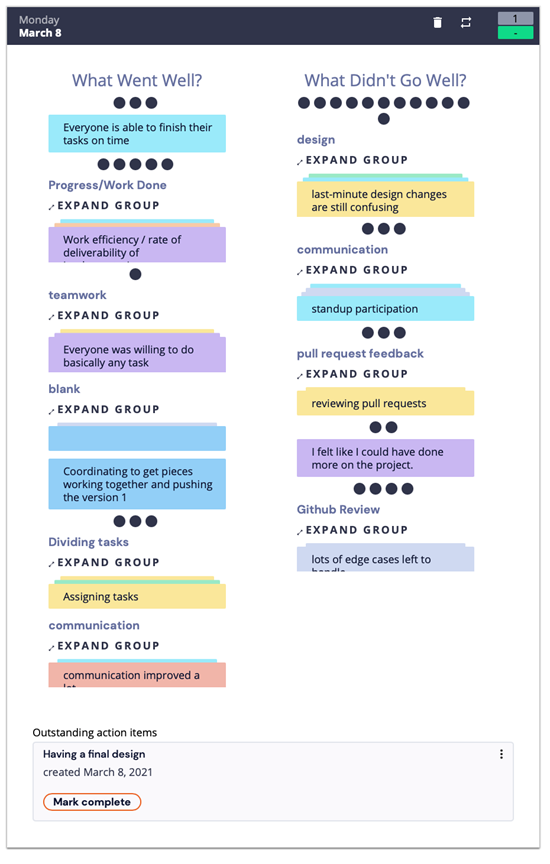
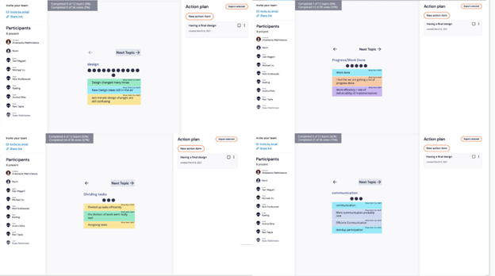

## Powell Rangers / Group #28

**Type of meeting:** Agile Retrospective for Week 9 sprint

**Which members were present:** Anastasiia Makhniaieva, Anshul Birla, Dan Magaril, Michael Vu, Nick Krolikowski, Kewen Zhao, Kyeling Ong, Ravi Tapia, Ryan Nishimoto

**Members who were not present:** None

**Where/when meeting was held:** zoom, 8:40, Mon 3/8/21

## Agenda of what was discussed:

**Old business:** None

**New business:** 
+ areas of improvement
+ [retrium](https://app.retrium.com/team-room/c23da7b5-53f5-4420-9230-e677e9fd9869/retro)
+ action plan: finalize design

**Anything on the agenda that was not discussed:** 
+ assign tasks tomorrow

## Concluding notes:

**Decisions made:** 
Design decisions:
- instead of background color box for timer, 2-corner border
- buttons horizontal display under timer
  -  disable distraction button before start/during break
-  current task and task list/table separate
-  table rows - either closer in color or spaced apart
-  \# of pomos input - without brackets
-  **collapsible table + dyanmically sized timer feature**
  -  during work session, timer is large, table is collapsed
  -  on transition to break, resize timer font/div/corners to make room for the table

**When the meeting finished:** 9:50 pm
